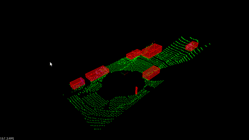

# Lidar Obstacle Detection 
## Sensor Fusion Engineer Nanodegree

This project contains code that demonstrates techniques of working 
with the real point cloud data collected with the Lidar sensor. 
The code extensively utilizes the 
[Point Cloud Library](http://pointclouds.org/) (PCL).
- The RANSAC algorithm is responsible for the separation between 
the road plane and obstacles. One can either choose between 
the PCL implementation of this algorithm or the custom implementation.
- The obstacle identification is made using the Euclidean clustering 
algorithm, which internally uses a k-d tree to speed up the search of 
points in the point cloud. One can either choose between 
the PCL implementation of this algorithm or use the custom 
implementation
- Internally, the Euclidean clustering algorithm uses a custom k-d tree to speed-up the
search of points lying in the close proximity with the provided target point. 
- The code uses the custom implementations for all the above by default. Uncomment
the macro ```USE_PCL``` defined in [src/processPointClouds.cpp](src/processPointClouds.cpp) to use
the PCL libraries for segmentation and clustering.

### Dependencies
- cmake >= 3.14
- gcc/g++ >= 8.0
- PCL >= 1.2

### Build
```
$> mkdir build
$> cd build
$> cmake ..
$> make
$> cd ..
```

### Run
```
$> cd build
$> ./environment
```

### Demo
#### Raw Point Cloud Data
the initial (unprocessed) point cloud:
<br>


#### Segmented and Clustered Point Cloud Data
The processed point cloud, with identified and clustered points belonging to obstacles.
Bounding boxes illustrate this separation:
<br>

